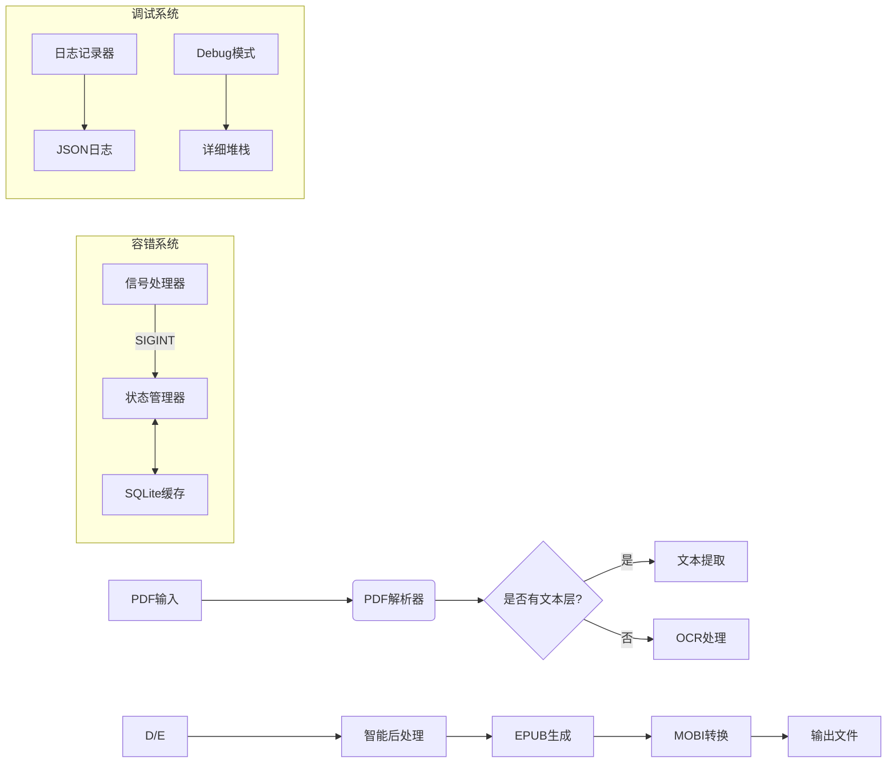
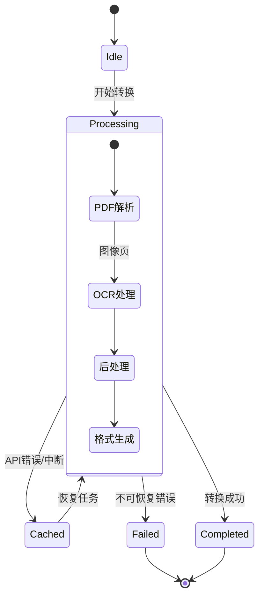

# Toepub - 智能PDF转EPUB/MOBI工具

## 项目概述

Toepub是一个高级工具，用于将扫描版PDF电子书转换为文字版的EPUB/MOBI格式，适配各种电纸书和微信读书等平台。该工具利用视觉模型API进行OCR识别，并通过智能处理解决常见的排版问题。

### 核心功能

- PDF文本层检测与提取
- 基于视觉模型API的OCR处理
- 智能文本结构化（修复不自然断句、段落识别）
- 多种页面类型识别与处理（封面、目录、注释、表格等）
- EPUB/MOBI格式生成与优化
- 断点续传与缓存管理
- 详细的开发者日志系统

## 技术架构



### 状态管理流程



## 项目结构

```
/toepub
├── core/                   # 核心处理模块
│   ├── pdf_parser.py       # PDF解析与预处理
│   ├── ocr_processor.py    # OCR处理与API调用
│   ├── text_cleaner.py     # 文本清洗与结构化
│   ├── epub_builder.py     # EPUB生成
│   └── page_processors/    # 特殊页面处理器
│       ├── base.py         # 处理器基类
│       ├── cover.py        # 封面处理
│       ├── toc.py          # 目录处理
│       ├── footnote.py     # 注释处理
│       └── table.py        # 表格处理
├── templates/              # 样式模板
│   ├── default.css         # 默认样式
│   ├── kindle.css          # Kindle优化
│   └── weixin.css          # 微信读书优化
├── utils/                  # 工具函数
│   ├── cache.py            # 缓存管理
│   ├── logger.py           # 日志系统
│   └── signal_handler.py   # 信号处理
├── config/                 # 配置文件
│   ├── settings.ini        # 主配置
│   └── logging.ini         # 日志配置
├── tests/                  # 测试套件
│   ├── test_pdf_parser.py
│   ├── test_ocr.py
│   └── fixtures/           # 测试数据
├── main.py                 # 命令行入口
├── requirements.txt        # 依赖列表
└── README.md               # 用户说明
```

## 快速开始

### 系统依赖

```bash
# Ubuntu/Debian
sudo apt install tesseract-ocr tesseract-ocr-chi-sim calibre python3-dev

# CentOS/RHEL
sudo yum install tesseract tesseract-langpack-chi-sim calibre python3-devel

# macOS
brew install tesseract tesseract-lang calibre

# Windows需手动安装：
# - Tesseract 5.0+ https://github.com/UB-Mannheim/tesseract/wiki
# - Calibre https://calibre-ebook.com
# - 确保将安装路径添加到系统PATH
```

### Python依赖

```bash
pip install -r requirements.txt
```

**requirements.txt内容：**
```
pymupdf>=1.23.0
pytesseract>=0.3.10
opencv-python-headless>=4.7.0
epub-builder>=1.2.0
sqlalchemy>=2.0.0
retrying>=1.3.0
python-dotenv>=0.19.0
rich>=13.0.0
click>=8.1.0
```

### 基本用法

```bash
# 基本转换
python main.py input.pdf -o output.epub

# 指定格式
python main.py input.pdf -o output.mobi --format mobi

# 从中断处恢复
python main.py input.pdf --resume

# 调试模式
python main.py input.pdf --debug
```

## 配置说明

### 主配置文件 (config/settings.ini)

```ini
[ocr]
# OCR API配置
api_endpoint = https://api.example.com/v2/ocr
api_key = your_api_key_here
timeout = 30
retry_count = 3
batch_size = 5

[cache]
# 缓存配置
db_path = ./toepub_cache.db
auto_resume = true
checkpoint_interval = 10
max_checkpoints = 3

[epub]
# EPUB生成配置
css_template = default
toc_depth = 3
max_image_width = 800
max_image_height = 1200
image_quality = 85

[debug]
# 调试配置
log_level = INFO  # DEBUG|INFO|WARNING|ERROR
log_format = json  # text|json
log_file = ./conversion.log
```

### 日志配置文件 (config/logging.ini)

```ini
[loggers]
keys=root,toepub

[handlers]
keys=console,file

[formatters]
keys=simple,json

[logger_root]
level=INFO
handlers=console

[logger_toepub]
level=DEBUG
handlers=console,file
qualname=toepub
propagate=0

[handler_console]
class=StreamHandler
level=INFO
formatter=simple
args=(sys.stdout,)

[handler_file]
class=FileHandler
level=DEBUG
formatter=json
args=('conversion.log', 'a', 'utf-8')

[formatter_simple]
format=%(asctime)s - %(name)s - %(levelname)s - %(message)s

[formatter_json]
format={"time":"%(asctime)s","level":"%(levelname)s","module":"%(module)s","message":"%(message)s"}
```

## 页面类型处理矩阵

| 页面类型       | 识别方式                          | 处理策略                                                                 |
|----------------|-----------------------------------|--------------------------------------------------------------------------|
| 封面           | 首页+图像占比>80%                | 提取为独立封面章节，生成`<meta>`标签                                      |
| 出版信息       | 关键词匹配+位置（前3页）         | 提取为版权页，生成`<section class="copyright">`                          |
| 目录页         | "目录"关键词+页码模式            | 构建TOC导航，生成EPUB3 landmarks                                        |
| 前言/序言      | 关键词匹配+章节特征              | 生成`<section class="preface">`                                          |
| 章节标题页     | 字体大小+位置+空白比例           | 生成`<h1>`-`<h6>`标签，添加到目录                                        |
| 注释页         | 小字体区域检测+脚注符号(※①②)     | 生成`<aside>`标签，EPUB3脚注系统                                          |
| 长注释页       | 页面底部区域+小字体              | 转换为尾注，生成`<section class="endnotes">`                             |
| 纯文本页       | 默认类型                         | 标准段落处理，修复断行                                                   |
| 引用段落       | 字体识别（楷体）+缩进分析         | 添加`<blockquote class="quote">`并应用CSS                                 |
| 表格页         | OpenCV线检测+单元格识别           | 转换为HTML表格或保留为图像（复杂表格）                                  |
| 多级目录       | 缩进分析+层次识别                | 生成嵌套`<nav>`结构，支持多级导航                                        |

## 中断处理协议

### Ctrl+C信号处理流程

```python
import signal
import sys
import json

def handle_interrupt(signum, frame):
    """处理SIGINT信号（Ctrl+C）"""
    logger.warning("检测到用户中断，正在保存当前状态...")
    
    # 保存当前处理状态
    state = {
        'current_page': page_num,
        'ocr_text': buffer,
        'error_context': last_api_response,
        'timestamp': datetime.now().isoformat()
    }
    
    # 写入检查点
    with open(f"checkpoint_{page_num}.json", "w", encoding="utf-8") as f:
        json.dump(state, f, ensure_ascii=False, indent=2)
    
    logger.info(f"状态已保存到checkpoint_{page_num}.json")
    print("\n转换已中断，使用 --resume 参数可从断点继续")
    sys.exit(130)  # 保留标准退出码

# 注册信号处理器
signal.signal(signal.SIGINT, handle_interrupt)
```

### 缓存自动清理机制

- 每10页生成一次检查点（可在配置中调整）
- 异常退出时保留最近3个检查点（可配置）
- 使用`--clean-cache`参数强制重置所有缓存

```python
def cleanup_checkpoints(max_keep=3):
    """清理旧检查点，只保留最新的N个"""
    checkpoints = glob.glob("checkpoint_*.json")
    if len(checkpoints) <= max_keep:
        return
    
    # 按修改时间排序
    checkpoints.sort(key=lambda x: os.path.getmtime(x), reverse=True)
    
    # 删除旧检查点
    for cp in checkpoints[max_keep:]:
        os.remove(cp)
        logger.debug(f"已删除旧检查点: {cp}")
```

## 智能换行修复算法

OCR处理后的文本常常保留了原PDF的不自然换行，以下是修复算法：

```python
def fix_ocr_linebreaks(text):
    """修复OCR文本中的不自然换行"""
    # 1. 合并错误换行（非句末标点后的换行）
    text = re.sub(r'([^\n。！？"」』])\n(?=[^"「『])', r'\1', text)
    
    # 2. 基于标点的自然分段（句末标点后添加换行）
    text = re.sub(r'([。！？"」』])(?=[^\n])', r'\1\n', text)
    
    # 3. 处理引用段落（保持缩进）
    text = re.sub(r'^(\s{2,})(.*?)$', r'\1\2\n', text, flags=re.MULTILINE)
    
    # 4. 处理段落间距（确保段落之间有空行）
    text = re.sub(r'\n{3,}', r'\n\n', text)
    
    return text
```

## 开发模式

### 日志分析

```bash
# 实时监控日志
tail -f conversion.log | jq 'select(.level == "ERROR")'

# 按模块过滤
cat conversion.log | jq 'select(.module == "ocr_processor")'

# 提取特定错误
cat conversion.log | jq 'select(.message | contains("API"))'
```

### 典型调试输出示例

```json
{
  "time": "2025-03-10T13:45:22",
  "level": "ERROR",
  "module": "ocr_processor",
  "message": "API响应超时",
  "context": {
    "page": 42,
    "retry_count": 2,
    "image_hash": "a1b2c3d4",
    "request_id": "req-5678"
  }
}
```

### 调试参数示例

```bash
# 基本调试模式
python main.py input.pdf --debug

# 详细日志级别
python main.py input.pdf --log-level DEBUG

# 限制处理页数（用于测试）
python main.py input.pdf --max-pages 10

# 显示处理进度条
python main.py input.pdf --progress

# 保存中间结果
python main.py input.pdf --save-temp

# 性能分析
python -m cProfile -o profile.stats main.py input.pdf
python -m pstats profile.stats
```

## API容错机制

```python
from retrying import retry

class OCRClient:
    def __init__(self, api_key, endpoint, timeout=30):
        self.api_key = api_key
        self.endpoint = endpoint
        self.timeout = timeout
        self.session = requests.Session()
        self.session.headers.update({
            "Authorization": f"Bearer {api_key}",
            "Content-Type": "application/json"
        })
    
    @retry(
        wait_exponential_multiplier=1000,  # 指数退避，初始1秒
        wait_exponential_max=30000,        # 最长等待30秒
        stop_max_attempt_number=3          # 最多重试3次
    )
    def ocr_page(self, image_data):
        """OCR处理单页图像"""
        try:
            response = self.session.post(
                self.endpoint,
                json={"image": base64.b64encode(image_data).decode()},
                timeout=self.timeout
            )
            
            if response.status_code == 429:  # 速率限制
                logger.warning("API速率限制，等待重试")
                raise RetryableError("Rate limit exceeded")
                
            if response.status_code == 402:  # 额度不足
                logger.error("API额度不足，无法继续")
                raise PermanentError("API credit exhausted")
                
            response.raise_for_status()
            return response.json()
            
        except (requests.Timeout, ConnectionError) as e:
            logger.warning(f"API连接错误: {e}")
            raise RetryableError(f"Connection error: {e}")
            
        except Exception as e:
            logger.error(f"OCR处理错误: {e}")
            # 记录详细上下文用于调试
            logger.debug({
                "error_type": type(e).__name__,
                "image_size": len(image_data),
                "endpoint": self.endpoint
            })
            raise
```

## 测试套件

```bash
# 运行所有测试
pytest tests/ -v

# 生成覆盖率报告
pytest tests/ --cov=core --cov-report=html:coverage_report

# 跳过耗时测试
pytest tests/ -m "not slow"

# 运行特定模块测试
pytest tests/test_pdf_parser.py
```

### 测试数据准备

测试套件使用`tests/fixtures/`目录中的样本PDF文件：

- `simple.pdf`: 简单文本PDF（有文本层）
- `scanned.pdf`: 扫描版PDF（无文本层）
- `complex.pdf`: 复杂排版PDF（表格、注释等）
- `corrupted.pdf`: 损坏的PDF文件（用于测试错误处理）

## 扩展开发

### 新增页面处理器

1. 在`core/page_processors/`创建新类，继承`BaseProcessor`：

```python
from .base import BaseProcessor

class NewTypeProcessor(BaseProcessor):
    """处理新类型页面"""
    
    @classmethod
    def detect(cls, page_image, page_text):
        """
        检测页面是否属于此类型
        
        参数:
            page_image: OpenCV图像对象
            page_text: 提取/OCR的文本
            
        返回:
            float: 置信度分数 0-1
        """
        # 实现检测逻辑
        confidence = 0.0
        
        # 例如，基于特定关键词
        if "特定关键词" in page_text:
            confidence += 0.5
            
        # 或基于图像特征
        if some_image_condition(page_image):
            confidence += 0.5
            
        return min(confidence, 1.0)
    
    def process(self):
        """
        处理页面并返回HTML内容
        
        返回:
            str: 处理后的HTML内容
        """
        # 实现处理逻辑
        html = f"<section class='new-type'>{self.clean_text()}</section>"
        return html
```

2. 在`core/page_processors/__init__.py`中注册新处理器：

```python
from .cover import CoverProcessor
from .toc import TOCProcessor
# ... 其他导入
from .new_type import NewTypeProcessor

# 处理器注册表（按优先级排序）
PROCESSOR_REGISTRY = [
    CoverProcessor,
    TOCProcessor,
    # ... 其他处理器
    NewTypeProcessor,  # 新增处理器
    # 通用处理器应放在最后
    TextProcessor  # 默认文本处理器
]
```

### 自定义CSS模板

在`templates/`目录中创建新的CSS文件，例如`custom.css`：

```css
/* 基本样式 */
body {
    font-family: "Source Han Serif CN", serif;
    line-height: 1.5;
    margin: 0 5%;
}

/* 标题样式 */
h1 {
    font-size: 1.5em;
    text-align: center;
    margin: 1em 0;
}

/* 自定义页面类型样式 */
.new-type {
    background-color: #f8f8f8;
    padding: 1em;
    border-left: 3px solid #ddd;
}
```

然后在配置中指定使用此模板：

```ini
[epub]
css_template = custom
```

## 性能优化建议

1. **批量处理**：使用`concurrent.futures`并行处理多页
2. **图像预处理**：使用OpenCV进行二值化、去噪和倾斜校正
3. **缓存策略**：使用LRU缓存减少重复OCR请求
4. **内存管理**：处理大型PDF时使用生成器模式避免内存溢出
5. **API成本优化**：实现智能采样，只对需要OCR的页面调用API

## 常见问题排查

| 问题                   | 可能原因                      | 解决方案                                           |
|------------------------|-------------------------------|---------------------------------------------------|
| OCR质量差              | 图像分辨率低/噪点多           | 增加`--preprocess`参数启用图像增强                 |
| 转换中断               | API限制/网络问题              | 使用`--resume`从断点继续                           |
| 内存溢出               | PDF过大                       | 使用`--batch-size`减小批处理大小                   |
| 表格识别错误           | 复杂表格结构                  | 使用`--keep-tables-as-images`保留表格为图像        |
| 目录生成不完整         | 目录页识别失败                | 使用`--manual-toc`手动指定目录页范围               |
| CSS样式不兼容          | 设备特定问题                  | 尝试不同的CSS模板`--css-template weixin`           |

## 贡献指南

1. Fork项目并克隆到本地
2. 创建新分支`git checkout -b feature/your-feature`
3. 提交更改`git commit -am 'Add new feature'`
4. 推送到分支`git push origin feature/your-feature`
5. 创建Pull Request

## 许可证

MIT

## 最新功能开发记录

### 文本清理功能增强 (v0.2.0)

在PDF2Epub v0.2.0版本中，我们对文本清理功能进行了重要增强，特别针对学术文献、教材和专业书籍的特殊排版需求。

#### 1. 页码和章节标题移除

学术文献通常在页面左上角包含页码和章节标题，这些内容在EPUB中是多余的。我们实现了智能检测和移除这些元素的功能：

```python
def remove_page_headers(self, text):
    """移除页面左上角的页码和章节标题"""
    # 分割为段落
    paragraphs = text.split('\n\n')
    cleaned_paragraphs = []
    
    for para in paragraphs:
        # 检测多种页码和章节标题模式
        # 模式1: 数字 + 空格 + 章节名 (如 "2 海德格尔《哲学献文》导论")
        if re.match(r'^\d+\s+[\u4e00-\u9fa5《》""''（）\[\]]+.*?[》」"）\]\.\。]', para):
            # 查找第一个句号，从句号后开始保留文本
            match = re.search(r'[。？！\.]\s*', para)
            if match:
                end_pos = match.end()
                if end_pos < len(para):
                    para = para[end_pos:].strip()
                else:
                    continue
        
        # 其他模式处理...
        
        if para.strip():
            cleaned_paragraphs.append(para)
    
    return '\n\n'.join(cleaned_paragraphs)
```

支持的页码和章节标题模式：
- 数字+章节名：如 "2 海德格尔《哲学献文》导论"
- 罗马数字+章节名：如 "IV 存在与时间"
- 字母+章节名：如 "A 基础概念"
- 章节标题+页码：如 "第一章 存在与时间 23"

#### 2. 脚注标记格式化

学术文献中的脚注标记（如①②③、[1]、(1)等）需要特殊处理以保持可读性：

```python
def format_footnote_markers(self, text):
    """将脚注标记转换为上标格式"""
    # 处理圆圈数字脚注标记
    circle_numbers = {
        '①': '1', '②': '2', '③': '3', '④': '4', '⑤': '5',
        '⑥': '6', '⑦': '7', '⑧': '8', '⑨': '9', '⑩': '10'
    }
    
    # 替换为HTML上标
    for circle, number in circle_numbers.items():
        text = text.replace(circle, f'<sup>{number}</sup>')
    
    # 处理其他脚注格式
    footnote_patterns = [
        (r'\[(\d+)\]', r'<sup>\1</sup>'),  # [1] -> <sup>1</sup>
        (r'\((\d+)\)', r'<sup>\1</sup>'),  # (1) -> <sup>1</sup>
        # 其他模式...
    ]
    
    # 脚注区域处理
    # ...
    
    return text
```

支持的脚注标记格式：
- 圆圈数字：①②③④⑤⑥⑦⑧⑨⑩
- 方括号数字：[1], [2], [3]
- 圆括号数字：(1), (2), (3)
- 星号数字：*1, *2, *3
- 其他特殊符号：†1, †2, †3

#### 3. 实现思路与设计决策

1. **模块化设计**：将不同的文本清理功能拆分为独立方法，便于维护和扩展
2. **正则表达式优化**：使用精心设计的正则表达式，平衡匹配精度和性能
3. **HTML标准兼容**：使用标准HTML元素（如`<sup>`）确保在各种EPUB阅读器中正确显示
4. **保守处理原则**：在无法确定的情况下，保留原始文本而非错误删除

#### 4. 测试与验证

为确保功能稳定性，我们使用了多种学术文献样本进行测试：
- 哲学文献（如海德格尔著作）
- 科学教材（包含大量公式和脚注）
- 历史文献（包含特殊章节标记）

#### 5. 未来改进方向

- 添加更多脚注格式识别模式
- 实现脚注内容与引用的自动链接
- 优化对多语言文献的支持
- 添加对数学公式的特殊处理

#### 6. 使用建议

对于处理学术文献，建议使用以下命令行参数：
```bash
python main.py input.pdf -o output.epub --academic-mode
```

`--academic-mode`参数将启用所有针对学术文献的优化处理。

### 交互式界面优化 (v0.2.0)

在PDF2Epub v0.2.0版本中，我们对交互式界面进行了多项优化，提升了用户体验和错误处理能力。

#### 1. 用户取消操作处理

为了提供更友好的用户体验，我们增强了对用户取消操作的处理：

```python
def select_pdf_file(pdf_files):
    """
    交互式选择PDF文件
    """
    questions = [
        inquirer.List('pdf_file',
                     message='选择要转换的PDF文件',
                     choices=pdf_files)
    ]
    
    answers = inquirer.prompt(questions)
    
    # 处理用户取消操作
    if answers is None:
        print("\n操作已取消。")
        sys.exit(0)
        
    return answers['pdf_file']
```

主要改进包括：
- 在每个`inquirer.prompt`调用后检查返回值是否为`None`（表示用户取消）
- 当用户取消时，显示友好的提示信息："操作已取消。"
- 优雅地退出程序（`sys.exit(0)`）

#### 2. 键盘中断处理

我们添加了对`KeyboardInterrupt`的捕获，确保用户可以随时安全地中断程序：

```python
def main():
    """
    主函数 - 交互式转换入口
    """
    print("=== PDF2Epub 交互式转换工具 v0.2.0 ===\n")
    
    try:
        # 获取PDF文件列表
        pdf_files = get_pdf_files()
        
        # 选择PDF文件
        input_path = select_pdf_file(pdf_files)
        
        # ...其他操作...
        
    except KeyboardInterrupt:
        print("\n\n操作已取消。")
        sys.exit(0)
```

#### 3. 进度条显示优化

为了提供更清晰的转换进度信息，我们优化了进度条显示：

```python
def process_pdf(input_path, output_path, max_pages=None, verbose=0, debug=False):
    # ...前置代码...
    
    # 创建进度条
    with tqdm(total=total_pages, desc=f"📊 转换进度 (页 0/{total_pages})", 
              bar_format="{desc}: {percentage:3.0f}%|{bar}| {n_fmt}/{total_fmt} [{elapsed}<{remaining}]") as pbar:
        
        for page_num, page in enumerate(pdf_document, 1):
            # 更新进度条描述
            if use_ocr:
                pbar.set_description(f"📊 转换进度 (页 {page_num}/{total_pages}, 已用tokens: {token_usage})")
            else:
                pbar.set_description(f"📊 转换进度 (页 {page_num}/{total_pages})")
            
            # 处理页面...
            
            # 更新进度条
            pbar.update(1)
```

主要改进：
- 简化信息模式下的输出，移除了每页处理时的单独日志输出
- 在进度条描述中集成了当前页码、总页数和token使用信息
- 保持界面简洁，只显示进度条和必要信息

#### 4. 日志级别统一

我们统一了日志级别的描述，使其更加直观：

```python
questions = [
    inquirer.List('log_level',
                 message='选择日志级别',
                 choices=[
                     ('基础级别 - 只显示警告和错误', 'user'),
                     ('信息级别 - 显示处理进度和基本统计信息', 'info'),
                     ('开发级别 - 显示详细技术信息', 'dev'),
                     ('调试模式 - 最详细的诊断信息', 'debug')
                 ],
                 default='user')
]
```

#### 5. 实现思路与设计决策

1. **防御性编程**：在所有用户交互点添加错误处理，确保程序不会因用户操作而崩溃
2. **一致的用户体验**：统一错误消息和提示风格，提供清晰的反馈
3. **渐进式信息展示**：根据用户选择的日志级别，提供不同详细程度的信息
4. **简洁界面设计**：减少不必要的输出，让用户专注于重要信息

#### 6. 未来改进方向

- 添加配置保存功能，记住用户的偏好设置
- 实现批处理模式，允许用户一次选择多个文件进行转换
- 添加转换后的预览功能
- 提供更详细的错误诊断和解决建议
